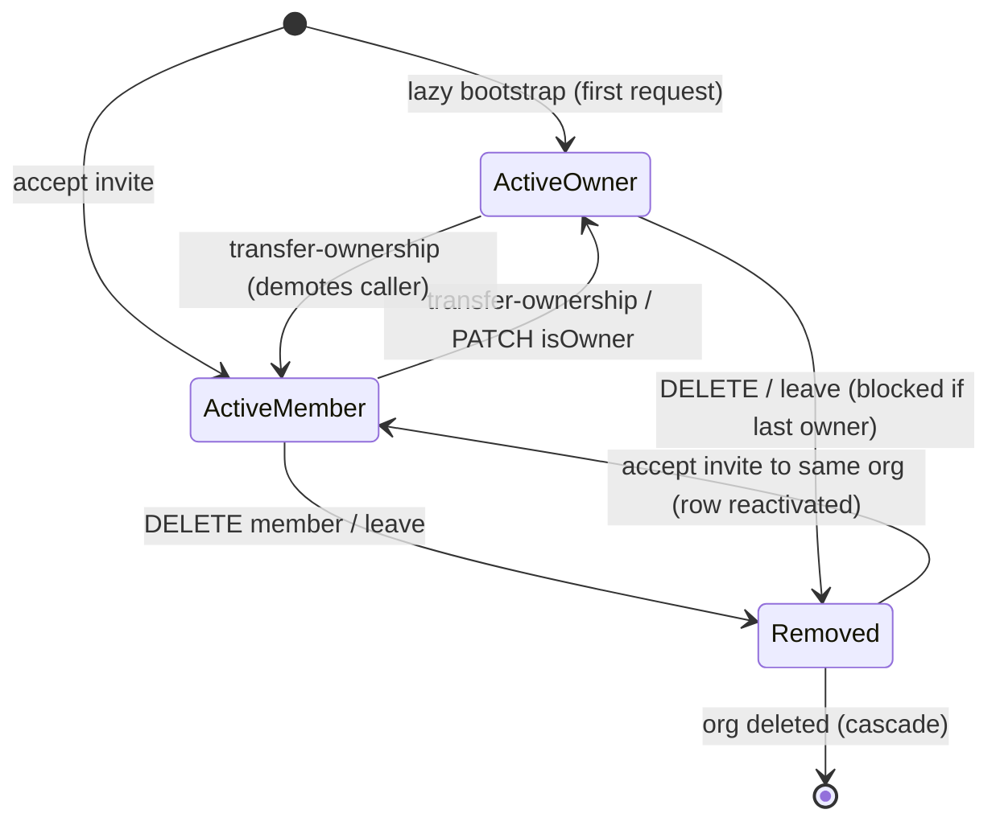
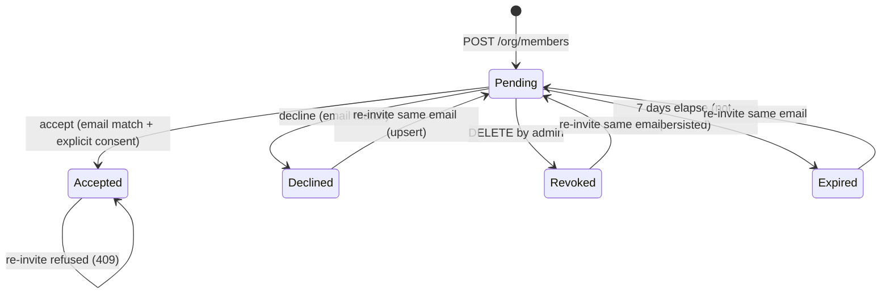
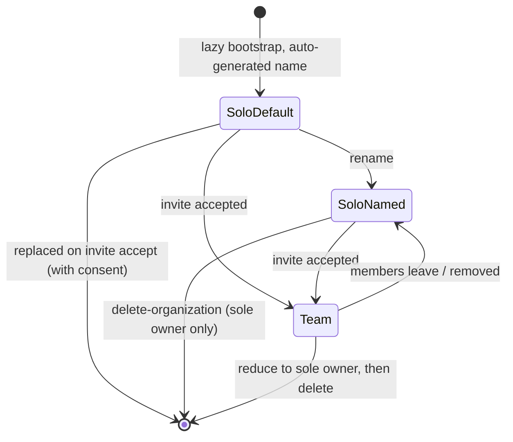

# Advertiser Organizations — Scenario Map & Gap Review

**Date:** 2026-09-15
**Status:** For review — not a spec, not a plan. A map of the state space as
currently implemented, for finding gaps.
**Scope:** `apps/api/app/v1/customer/org/**`, `apps/api/app/v1/customer/campaigns/**`,
`apps/api/app/v1/advertiser-orgs/**`, `apps/customer-web`, `apps/customer-mobile`,
`apps/ops`, `apps/ops-mobile`.

Related: [design spec](./2026-09-07-advertiser-organizations-design.md) ·
[AUTH.md](../../shared/AUTH.md) · phase plans in [../plans](../plans)

Legend: **✅ built** · **◐ partial** · **✗ absent** · **❓ open question** · **🔴 confirmed defect**

---

## 0. Confirmed defects found during this review

Four items were uncertain when the map was first drafted. All were run down
against the code, all four were real, and **all four are now fixed** — §0.1–§0.3
following a review decision on 2026-09-15.

### 0.1 ✅ Privilege escalation: `team:manage` could self-promote to owner — **fixed**

`PATCH /v1/customer/org/members/[id]`
([route](../../../apps/api/app/v1/customer/org/members/%5Bid%5D/route.ts)) is
gated on `requireCustomerPermissionAccess("team:manage")` **only**. There is no
`is_owner` check, and the handler accepts `{ isOwner: true }`:

```ts
const nextIsOwner = parsed.data.isOwner ?? member.is_owner
// ... no guard that the *caller* is an owner
data: { is_owner: nextIsOwner, role_id: nextRoleId }
```

The roles editor renders a checkbox for **every** entry in
`ADVERTISER_PERMISSIONS`, including `team:manage` and `org:manage`, on both web
and mobile. So the path is fully reachable:

1. Owner creates a custom role granting `team:manage` (a plausible "Manager").
2. Owner assigns it to a member.
3. That member calls `PATCH /org/members/<their own id>` with `{ isOwner: true }`.
4. They are now an owner — implicit holder of *every* permission, including
   `billing:write`, `org:manage`, and the ability to delete the organization.

Owner-only is enforced on role CRUD, transfer-ownership and delete-organization,
but not on the one route that can *mint* an owner. Note the member can also
promote **anyone else**, or demote other members.

**Decided:** `isOwner` changes now require `is_owner` on the caller and refuse
to act on the caller's own membership, matching transfer-ownership. Members who
need more access raise an `AdvertiserAdminRequest` with a written reason for an
owner to approve or deny — see §8.

### 0.2 ✅ Inviting an address that is already an active member — **fixed**

`POST /v1/customer/org/members` checks the *invitation* row for
`accepted_at`, but never checks whether the email already belongs to an active
`AdvertiserMember` of this org. Two outcomes:

- **Existing non-owner member re-invited** → a pending invite is created. On
  accept they get *"You're already part of {org} ({n} members) — leave it from
  Settings before joining a different organization."* The org named is the one
  they're being invited to. Confusing, not destructive.
- **Sole owner invites their own address** → accepting hits the solo-org branch
  and offers "leave and join". Confirming calls `detachAndDeleteOrg(orgId)` and
  then creates a membership in `invitation.org_id` — **the org just deleted**.
  Detaches every campaign and support case, then fails.

Self-inflicted, but nothing stops it.

**Decided:** rejected up front with `409` ("already a member", or "you're
already a member" when it's the caller's own address), resolving the email
through `findClerkUserIdByEmail`.

### 0.3 ✅ A declined invitation was invisible to the admin — **fixed**

`declined_at` is recorded and excluded from pending lists — but neither
`team-settings-view.tsx` nor mobile `team.tsx` references invitation `status` or
`declined`. The row simply disappears from the admin's pending list, identical
to one that was never sent. The whole reason `declined_at` is distinct from
`revoked_at` was so the admin could tell the difference, and no surface does.

**Decided:** both. Declined rows are returned by `GET /org/members` regardless
of expiry and render in Team with a **Declined** badge and an **Ask again**
action (web + mobile); the inviter also gets an inbox notification and push the
moment someone declines.

### 0.4 ✅ Re-inviting someone who declined produced a dead row — **fixed**

The re-invite upsert in `POST /v1/customer/org/members` cleared `revoked_at`
and `accepted_at` but not `declined_at`, while the accept gate refuses any row
with `declined_at` set. So inviting someone again after they declined issued a
fresh token and email for an invitation that could **never** be accepted — a
dead end with no error on either side.

Introduced with `declined_at` in the same change that added decline. Fixed by
clearing it in the upsert alongside the other two.

---

## 1. Actors

| Actor | Identity source | Reaches an org via |
|---|---|---|
| Prospective advertiser | none yet | public sign-up |
| Solo advertiser | customer Clerk | lazy bootstrap → org of one, owner |
| Org owner (`is_owner`) | customer Clerk | bootstrap, invite accept, or transfer |
| Org member (role-bound) | customer Clerk | invite accept only |
| Removed member (`removed_at`) | customer Clerk | soft-deleted row; 403 on every request |
| Invitee without an account | email address only | invite token |
| Invitee who already has an org | customer Clerk | invite token + conflict resolution |
| Ops staff | ops Clerk + `campaigns` permission | read-only org views, campaign review |
| Token holder who is not the invitee | anyone with the URL | blocked by email match |

---

## 2. Object state machines

### 2.1 Member



| State | `is_owner` | `role_id` | `removed_at` | Status |
|---|---|---|---|---|
| Active owner | true | null | null | ✅ |
| Active member | false | set | null | ✅ |
| Member with no role | false | null | null | ◐ PATCH rejects it ("Non-admins must have a role"), but no DB constraint |
| Removed | any | any | set | ✅ |

`AdvertiserMember.clerk_user_id` is `@unique` — one org per user in v1, enforced
by the database rather than app code.

### 2.2 Invitation



One row per `(org_id, email)`. Re-inviting mutates in place with a fresh token
and expiry, clearing `revoked_at`, `accepted_at` and `declined_at`.

### 2.3 Organization



### 2.4 Campaign

Statuses: `draft` · `submitted` · `approved` · `rejected` · `changes_requested` · `cancelled`.
Editable set (`EDITABLE_STATUSES`): `draft`, `changes_requested`, `rejected`.

---

## 3. Capability matrix

Owner = implicit full permission set. Starter `Member` role holds
`campaigns:read`, `campaigns:write`, `creatives:write`, `reports:read`.

| Capability | Permission | Owner | Starter Member | Grantable to a custom role? |
|---|---|---|---|---|
| View campaigns | `campaigns:read` | ✅ | ✅ | ✅ |
| Create / edit campaigns | `campaigns:write` | ✅ | ✅ | ✅ |
| **Submit campaign** | `campaigns:submit` | ✅ | ✗ | ✅ |
| Upload / delete creative | `creatives:write` | ✅ | ✅ | ✅ |
| View reports | `reports:read` | ✅ | ✅ | ✅ |
| View billing details | `billing:read` | ✅ | ✗ | ✅ |
| Edit billing details | `billing:write` | ✅ | ✗ | ✅ |
| List / invite / remove members | `team:manage` | ✅ | ✗ | ✅ |
| Rename org | `org:manage` | ✅ | ✗ | ✅ |
| View activity feed | `activity:read` | ✅ | ✗ | ✅ |
| See all org support cases | `support:read_all` | ✅ | ✗ | ✅ |
| **Promote / demote a member** | `team:manage` **+ `is_owner`** | ✅ | ✗ | ✗ owner-only |
| **Request admin access** | none (any non-owner member) | n/a | ✅ | n/a |
| **Review an admin request** | `is_owner` | ✅ | ✗ | ✗ |
| Create / edit / delete roles | `team:manage` **+ `is_owner`** | ✅ | ✗ | ✗ owner-only, hard-coded |
| Transfer ownership | `org:manage` **+ `is_owner`** | ✅ | ✗ | ✗ |
| Delete organization | `org:manage` **+ `is_owner`** | ✅ | ✗ | ✗ |
| Leave org | none (self-service) | ✅¹ | ✅ | n/a |

¹ Blocked while sole owner.

**Review point:** every capability that changes who holds power — role CRUD,
promotion, transfer, deletion — now requires `is_owner` in addition to a
permission. A custom role granting `team:manage` can shape the team but cannot
mint an admin; that route goes through a reviewed request instead.

---

## 4. Scenario catalogue

### 4.1 Onboarding & bootstrap

| # | Situation | Status |
|---|---|---|
| 1 | Sign up with company name → org named from it | ✅ |
| 2 | Google SSO without company name → `"{First}'s Organization"` + dismissible nudge | ✅ |
| 3 | Two concurrent first requests → exactly one org (unique-constraint race) | ✅ tested |
| 4 | Bootstrap fails → request errors loudly, never an empty campaign list | ✅ |
| 5 | Advertiser predating orgs → one-off backfill script | ✅ |
| 6 | Org name left as default forever; ops sees `"Jane's Organization"` in review | ◐ nudge only, dismissible |

### 4.2 Invitation — sending

| # | Situation | Status |
|---|---|---|
| 7 | Invite a new email → row + token + Resend email | ✅ |
| 8 | Re-invite the same email → token/expiry refreshed, re-sent | ✅ |
| 8a | Re-invite after a decline → acceptable again | ✅ fixed §0.4 |
| 9 | Invite someone who already accepted → 409 | ✅ |
| 10 | Invite rate limit (10 / 10 min / user) | ✅ |
| 11 | Revoke a pending invite | ✅ |
| 12 | Email send fails → invite row still created, error only logged | ◐ invitee never learns; admin still sees "pending" |
| 13 | **Invite an address already an active member of this org** | ✅ fixed §0.2 |
| 14 | Delete a role that pending invites reference → blocked | ✅ |
| 15 | Bulk invite / CSV import | ✗ |
| 16 | Resend throttled separately from first-send | ✗ shares the 10/10min bucket |
| 17 | Invite copy states which role the invitee is getting | ✅ in preview |

### 4.3 Invitation — accepting & declining

| # | Situation | Status |
|---|---|---|
| 18 | Preview names org, role and inviter before any action | ✅ |
| 19 | Preview readable signed-out, so sign-up is informed | ✅ |
| 20 | No account → "Create an account" primary; company field suppressed | ✅ |
| 21 | Signed in, no org → Accept / Decline | ✅ |
| 22 | Signed in, empty solo org → consent still required; copy says it's empty | ✅ |
| 23 | Signed in, solo org holding work → destructive confirm naming the counts | ✅ |
| 24 | Signed in, org with teammates → no accept path; told to leave or transfer | ✅ |
| 25 | Decline → `declined_at` stamped; own org untouched | ✅ |
| 26 | Wrong email signed in → 403 naming the expected address | ✅ |
| 27 | Clerk cannot resolve the caller's email → **fails closed** | ✅ |
| 28 | Expired token → 410 | ✅ |
| 29 | Revoked / already-accepted / already-declined → 409 | ✅ |
| 30 | Removed member accepts an old invite to the same org → row reactivated | ✅ |
| 31 | Removed member accepts an invite to a *different* org → 409 | ✅ |
| 32 | Accepting detaches your campaigns — warned, but no export offered | ◐ irreversible |
| 33 | **Admin sees that an invite was declined, and can ask again** | ✅ fixed §0.3 |
| 34 | Forwarded invite email → email match blocks the wrong person | ✅ |
| 35 | Token brute force | ✅ 32-byte token + per-user rate limit |
| 36 | Invite accepted on mobile via universal link | ◐ needs `.well-known` env vars; falls back to browser |

### 4.4 Membership management

| # | Situation | Status |
|---|---|---|
| 37 | Change a member's role | ✅ |
| 38 | Promote a member to owner | ✅ owner-only — §0.1 |
| 38a | Member requests admin access with a reason; owner approves or denies with a note | ✅ |
| 38b | Owners notified of a new request; requester notified of the decision | ✅ |
| 38c | One open request per member; 5/hour rate limit | ✅ |
| 38d | Requester withdraws their own pending request | ✗ status exists, no route |
| 39 | Transfer ownership (caller demoted in the same transaction) | ✅ |
| 40 | Remove a member (soft delete) | ✅ |
| 41 | Last-owner protection on demote / remove / leave / delete-org | ✅ ×4 |
| 42 | Removed member's requests → 403 with re-invite guidance | ✅ |
| 43 | Permission cache invalidated on role change (60 s TTL ceiling) | ✅ |
| 44 | Member notified when their role changes | ✗ |
| 45 | Member notified when they are removed | ✗ |
| 46 | New owner notified when ownership is transferred to them | ✗ || 47 | Multiple owners supported | ✅ `is_owner` is not unique |
| 48 | Removed member's name still resolves on campaigns they authored | ✅ soft delete |
| 49 | Member list pagination | ◐ capped at 200, no paging |
| 50 | Re-invite a removed member → reactivates the row | ✅ |

### 4.5 Roles

| # | Situation | Status |
|---|---|---|
| 51 | List assignable roles (starters + org customs, overrides applied) | ✅ |
| 52 | Create a custom role | ✅ owner-only |
| 53 | Edit a starter → clones to the org, reassigns members and pending invites | ✅ |
| 54 | Rename clash (case-insensitive, across starters and customs) → blocked | ✅ |
| 55 | Delete a role with members assigned → blocked | ✅ |
| 56 | Delete a role with pending invites → blocked | ✅ |
| 57 | Delete a starter role → blocked ("customize instead") | ✅ |
| 58 | A role granting `team:manage` cannot manage roles or mint admins | ✅ by design — §0.1 |
| 59 | Role duplication / templates | ✗ |
| 60 | Role change takes effect for a signed-in user | ✅ cache invalidated |

### 4.6 Campaigns in a team context

| # | Situation | Status |
|---|---|---|
| 61 | Campaigns scoped by `org_id` in every read path | ✅ |
| 62 | Cross-org read → 404, not 403 (no id enumeration) | ✅ tested |
| 63 | Author shown (`created_by_name`) on list, detail and ops views | ✅ |
| 64 | Member drafts, owner submits | ✅ Submit hidden without `campaigns:submit` |
| 65 | Submit / review notifies every member with `campaigns:read` | ✅ |
| 66 | Decision email goes to `contact_email` only, not the whole org | ◐ deliberate |
| 67 | Two members edit the same draft simultaneously | ✗ last-write-wins, no locking |
| 68 | Campaign frozen while `submitted` / `approved` | ✅ |
| 69 | Any member with `campaigns:write` can delete another's draft | ❓ intended? |
| 70 | Detached campaign (`org_id = null`) unreachable by any advertiser | ◐ ops record only, no recovery |

### 4.7 Organization lifecycle & destruction

| # | Situation | Status |
|---|---|---|
| 71 | Rename the org | ✅ |
| 72 | Billing email + KRA PIN | ✅ `billing:read` / `billing:write` |
| 73 | Leave org (non-owner) | ✅ |
| 74 | Sole owner blocked from leaving | ✅ |
| 75 | Delete org (sole owner) with detachment counts in the confirm | ✅ |
| 76 | Sole-owner account deletion blocked until transfer or org delete | ✅ |
| 77 | Org deletion cascades members/invites/roles; campaigns + cases detach | ✅ |
| 78 | Undo window or grace period on org deletion | ✗ immediate |
| 79 | Export before deletion | ✗ |
| 80 | Ops can restore a deleted org | ✗ rows are gone |

### 4.8 Support & notifications

| # | Situation | Status |
|---|---|---|
| 81 | Support case stamps `org_id` at creation | ✅ |
| 82 | `support:read_all` sees all org cases; others see only their own | ✅ |
| 83 | Notification inbox filtered to the caller's current org | ✅ |
| 84 | Shared support email across members → identity-token collision | ◐ `SupportIdentity` is email-keyed, org-unaware |
| 85 | Org-wide announcement targeting | ✗ broadcasts key on `clerk_user_id` |

### 4.9 Ops

| # | Situation | Status |
|---|---|---|
| 86 | Org directory + detail (members, invites, campaigns, activity) | ✅ web + mobile |
| 87 | Campaign **Company** links through to the org | ✅ |
| 88 | Activity allowlist — no ops emails or raw summaries leak | ✅ tested |
| 89 | Ops can rename, re-invite, remove a member, or transfer ownership | ✗ read-only |
| 90 | Ops can find orphaned (`org_id = null`) campaigns | ✗ |
| 91 | Ops support-login / impersonation | ✗ |
| 92 | Ops can see declined or revoked invite history | ◐ pending only |

---

## 5. Cross-cutting dimensions

These multiply every row above. Worth walking a few deliberately rather than
assuming they compose.

| Axis | Values |
|---|---|
| Surface | customer-web · customer-mobile · ops-web · ops-mobile · email |
| Auth state | signed out · signed in · wrong account · removed member · expired session |
| Org shape | none yet · solo default-named · solo named · two-person · many |
| Role | owner · starter Member · custom role · no role |
| Connectivity | online · offline (mobile) · slow · request fails mid-mutation |
| Concurrency | two admins acting at once · accept + revoke · transfer + leave |
| Data volume | 0 campaigns · 200+ members · 1000+ activity rows |

### Races worth probing

- Admin revokes an invite **while** the invitee is on the accept screen.
- Two owners each demote the other simultaneously.
- Member accepts an invite **while** an admin removes them from their current org.
- Owner deletes the org **while** a member is submitting a campaign.
- Role permissions edited **while** a holder of that role has a request in flight.

---

## 6. Absent or undecided, grouped for triage

**Communication** — most likely to bite in real use
- No notification on role change, removal or ownership transfer (#44–46)
- Invite email failure is silent to both parties (#12)

**Recovery & safety**
- No export before org deletion or workspace replacement (#32, #79)
- No undo window on destructive actions (#78)
- No route back for detached campaigns (#70, #90)

**Ops capability**
- Entirely read-only; no assisted recovery, no support-login (#89, #91)

**Scale**
- Member list unpaginated (#49); no bulk invite (#15)

**Model gaps**
- `SupportIdentity` not org-aware (#84)
- Announcements not org-targetable (#85)

**Explicitly out of scope in the design spec** (listed so they aren't re-raised as gaps)
- Multi-org membership and an org switcher
- Seat limits and per-seat billing — waits on Pesapal
- SAML / SSO / SCIM provisioning
- Email-domain auto-join — rejected; consumer domains would merge strangers
- Per-org rate limits — the limiter is per-user

---

## 7. Open questions for the reviewer

§0.1–§0.4 were decided and implemented on 2026-09-15. Remaining:

1. Should any member with `campaigns:write` be able to delete another member's
   draft? (#69)
2. Is contact-email-only decision mail right, or should the org be copied? (#66)
3. Does ops need any mutation capability over advertiser orgs before launch? (#89)
4. Should a requester be able to withdraw a pending admin request? (#38d)
5. Should role changes, removals and ownership transfers notify the affected
   member? (#44–#46 — the admin-request flow now sets a precedent for this)
